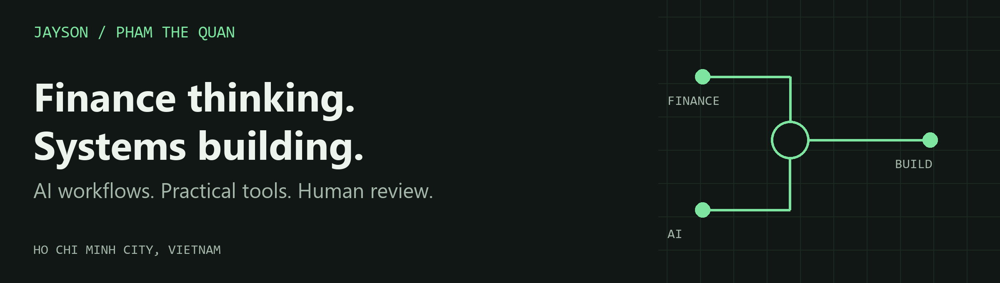
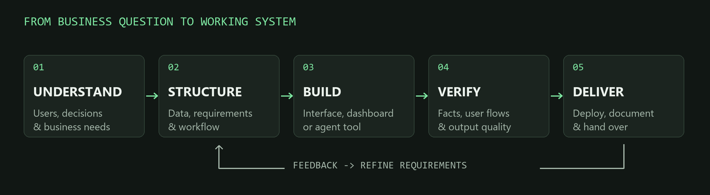
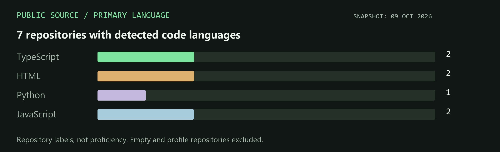

  <a href="https://jayson-portfolio-sigma.vercel.app/"><strong>Portfolio ↗</strong></a> &nbsp; / &nbsp;
  <a href="https://www.linkedin.com/in/ptquan2004/">LinkedIn ↗</a> &nbsp; / &nbsp;
  <a href="mailto:ptquan.work@gmail.com">Email ↗</a>

I’m **Jayson (Pham The Quan)**, a Finance-trained, AI-assisted builder based in Ho Chi Minh City, Vietnam. I turn business requirements, scattered information and repeated work into practical interfaces, dashboards and agent workflows.

My work connects **business analysis, product thinking and hands-on execution**: building Odoo-connected operations for Steersman, supporting frontend and Agent OS prompt workflows at QuickFish, and experimenting with personal knowledge and automation systems.

## Selected builds

| Project | What I worked on | Explore |
| :--- | :--- | :--- |
| **QuickFish · Agent Workspace** | Frontend and user-flow support; agent role instructions, prompt structure, review checklists and handoff notes. Public aquarium workspace review build with architecture documentation. | [Source & architecture](https://github.com/ptquanwork-cmyk/quickfish-agent-workspace) · [Platform](https://quickfish.org/en) |
| **Steersman · Business Systems** | Freelance delivery of an Odoo operating workspace and connected dashboard; Google Apps Script owner-facing finance input, consolidation, KPI reports and charts. | [Case studies](https://jayson-portfolio-sigma.vercel.app/) · [Brand website](https://steersman-site.vercel.app/en) |
| **JayVault · Knowledge Workflow** | Personal Obsidian-based workflow for articles, videos and PDFs; markdown summaries, research notes and daily trend reports. | [Demo](https://jayvault.vercel.app/) · [Source](https://github.com/ptquanwork-cmyk/obsidian) |
| **Autojob · Application Workbench** | Local application workflow using an evidence file, reviewer passes and document page fitting. Adapted from an open-source application-assistant workflow, credited in the repository. | [Source & setup](https://github.com/ptquanwork-cmyk/autojob) |
| **Expara · Assessment Hub** | Venture assessment and program-design work organized into a browsable hub. An assessment project, with research and execution frameworks. | [Demo](https://expara.vercel.app/) · [Source](https://github.com/ptquanwork-cmyk/Expara) |
| **BLOCK71 · Event Board** | A public information board for the Vietnam–Singapore innovation cooperation announcement on 29 May 2026. | [Demo](https://vercel-event-board.vercel.app/) |

## How I work

- **Start with the problem:** map the user, the decision and the repeated task.
- **Build with AI, review with evidence:** check facts, flows and outputs; make instructions and handoffs explicit.
- **Make the result usable:** responsive interfaces, readable reports, UAT, deployment and documentation.

## Toolkit in context

| Area | Tools and working methods |
| :--- | :--- |
| **Interfaces & delivery** | HTML / CSS / JavaScript, AI-assisted frontend prototyping, GitHub, Vercel, responsive QA |
| **Business systems & data** | Odoo, Google Apps Script, Excel / VBA / Solver, Power BI, Stata, financial models and dashboards |
| **Agents & automation** | Codex, Claude Code / Cowork, Hermes Agent, OpenRouter, MCP, Make, n8n, reusable prompts and scheduled workflows |
| **Knowledge & design** | Obsidian, markdown research workflows, Figma, Canva, Blender |

## Public repository footprint

Source: GitHub repository metadata, 9 Oct 2026. Counts use each repository’s primary language. They describe source composition, not skill ratings; private client work is outside this chart.

## Background & current exploration

- **Finance foundation · UEH:** financial modelling, valuation, risk analysis and ESG research.
- **BLOCK71 Vietnam / NUS Enterprise · Nov 2025–Jun 2026:** Venture Analyst internship in the Program Team; event/program support, tracking, documentation and AI training assets.
- **Personal agent infrastructure:** a working local system with Hermes Agent, OpenRouter and MCP; kanban state, execution loops and multi-agent workflows. Demo on request.
- **Building interests:** agent tools, knowledge retrieval, business workflow automation and decision-support interfaces.

<strong>A little beyond the screen</strong>

I enjoy badminton, pickleball, swimming, electric guitar, bass, percussion, reading and perfume collecting. I also spend time building AI workspaces and experimenting with better systems for learning and everyday work.

Vietnamese: native · English: IELTS 7.0, including Speaking 8.0.

---

Interested in building a practical AI tool or improving a business workflow? **[Let’s connect](mailto:ptquan.work@gmail.com).**
